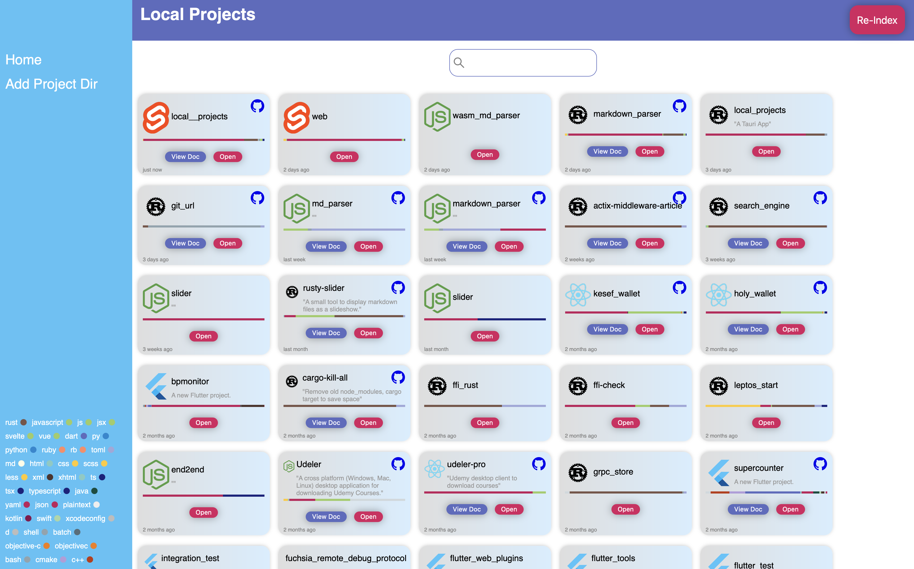

# Local Projects

All your local development projects at one place



### Running Locally

```
cargo tauri dev
```

### Building a production app

```
cargo tauri build
```

### How to run
* Add project directories using `Add Project Dir` Menu in the side bar
* After adding, it should take a while, or manually run `Re-Index` in the Top Bar

### What it has ?

- Listing projects at once
- Sorted by last modified
- Opens the project in an IDE (currently VSCode)
- Multi-Threaded searching for projects 
- Shows Github like language percentage for each project
- Open the repository in browser, if the project has a git repository
- View project's documentation, (currently supporting Readme.md) using self build [markdown parser](https://github.com/manishsingh10895/markdown-parser-rust)
- Fast search using [**(tf-idf)**](https://en.wikipedia.org/wiki/Tf%E2%80%93idf) method, search term looks into `Project Name`, `Project Description`, `Project Documentation`.
